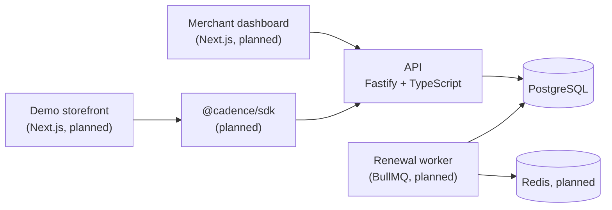
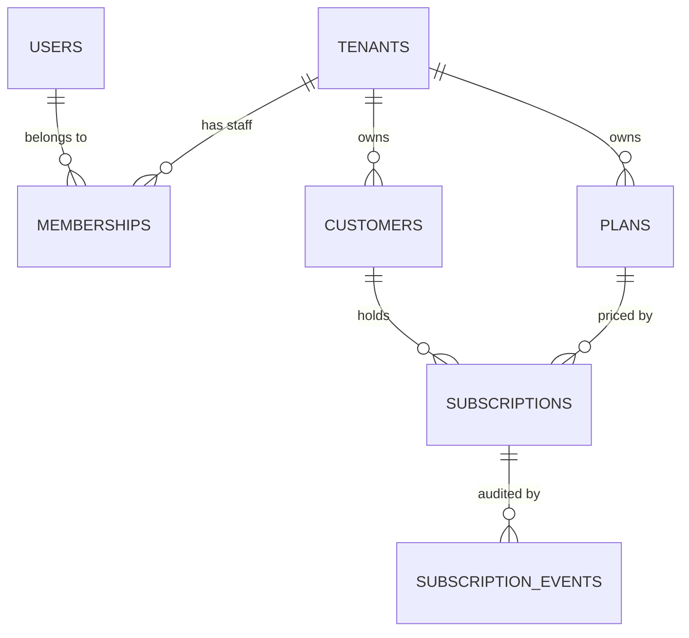
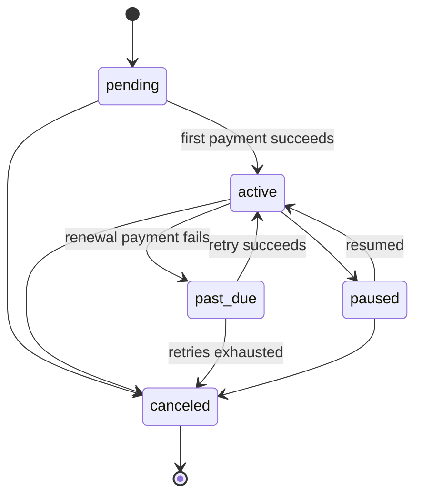

# Cadence

**A multi-tenant subscription commerce platform for recurring-delivery businesses** — milk, meals, groceries, anything a customer receives on a schedule.

Merchants define plans, enrol customers, and Cadence handles the subscription lifecycle: activation, renewals, pauses, failed payments, and cancellations, with a complete audit trail.

> **Status:** under active development. The data layer and core API are in place; authentication, payments, and the merchant dashboard are next. See the [roadmap](#roadmap).

---

## Why this project

Subscription billing looks like CRUD until you hit the real problems: a double-clicked "Subscribe" button that bills a customer twice, a renewal date that drifts from the 31st to the 28th forever, two workers updating the same subscription at once, or one merchant's data leaking into another's.

Cadence is built around solving those problems **at the right layer**, with most guarantees enforced by the database itself rather than relying on application code being bug-free.

---

## Architecture



The API owns all business logic so that every consumer (the dashboard, the storefront SDK, and background workers) shares one source of truth.

---

## Tech stack

| Layer      | Choice                                                                                                                |
| ---------- | --------------------------------------------------------------------------------------------------------------------- |
| API        | Node.js, Fastify, TypeScript                                                                                          |
| Validation | Zod (via `fastify-type-provider-zod`)                                                                                 |
| Database   | PostgreSQL 17, Drizzle ORM, Drizzle Kit migrations                                                                    |
| Monorepo   | pnpm workspaces, Turborepo                                                                                            |
| Planned    | Next.js (App Router), Redis + BullMQ, Razorpay (test mode), Vitest, Playwright, OpenTelemetry, Docker, GitHub Actions |

---

## Data model



- **Users** are merchant staff who log in; **customers** are the merchant's end buyers. They are deliberately separate tables.
- Users and tenants are many-to-many through **memberships**, which carry the role (`owner`, `admin`, `member`).
- **Subscription events** form an append-only audit log of every status change.

### Subscription lifecycle



`canceled` is terminal: a returning customer gets a new subscription, so history stays truthful. "Cancel at period end" is a flag on an active subscription, not a separate state.

---

## Key design decisions

**Tenant isolation enforced by the database.** Subscriptions reference customers and plans through composite foreign keys on `(tenant_id, id)`, so a subscription cannot point at another tenant's customer or plan even if application code has a bug.

**Money as integers.** Amounts are stored in minor units (paise) with an ISO currency code. No floats anywhere near money.

**Prices are history, not state.** Plans are archived and replaced rather than edited, so existing subscribers keep the price they signed up for.

**Constraints live in the database.** Check constraints keep each subscription's status consistent with its timestamps (for example, `canceled` if and only if `canceled_at` is set) and require billing periods for live statuses. Zod validates at the API boundary for friendly errors; the database is the final guarantee.

**Soft deletes that still allow re-use.** Archived rows are excluded from partial unique indexes, so an archived customer's email can be used again while history is preserved.

**Case-insensitive uniqueness.** Emails are unique on `lower(email)`, scoped per tenant for customers.

**Drift-free billing dates.** Periods are computed from a stored `billing_anchor_at` (`anchor + n × interval`) rather than chained from the previous period end, so a subscription anchored on the 31st renews on each month's last day instead of drifting to the 28th. Periods are half-open `[start, end)`.

**No double billing.** At most one live subscription per customer per plan, enforced by a partial unique index. See [ADR 001](docs/adr/001-one-live-subscription-per-plan.md).

**Indexes designed from query plans.** Every index was justified with `EXPLAIN`. For example, the renewal worker's query uses a partial index on `current_period_end` covering only billable statuses, so it stays small however much canceled history accumulates.

**Errors that help clients without leaking internals.** A central error handler maps Postgres error codes to HTTP responses (`23505` → 409, `23503` and `23514` → 422) with friendly per-constraint messages. Unexpected errors return a generic 500 with a `requestId`; full details go only to the server logs.

**Operability from day one.** Environment variables are validated at startup (the server refuses to boot with bad config), `/health` and `/ready` separate liveness from readiness, and shutdown drains in-flight requests before closing the connection pool.

Architecture decisions are recorded in [`docs/adr`](docs/adr).

---

## Getting started

### Prerequisites

- Node.js 22 or later
- pnpm
- PostgreSQL 17

### Setup

```bash
git clone https://github.com/EmmanuelRaju/cadence.git
cd cadence
pnpm install

createdb cadence_dev
cd apps/api
cp .env.example .env   # then set DATABASE_URL

pnpm drizzle-kit migrate
pnpm dev
```

### Environment variables

| Variable       | Required | Default       | Description                           |
| -------------- | -------- | ------------- | ------------------------------------- |
| `DATABASE_URL` | Yes      |               | PostgreSQL connection string          |
| `PORT`         | No       | `3000`        | Port the API listens on               |
| `NODE_ENV`     | No       | `development` | `development`, `test` or `production` |

---

## API

| Method | Path           | Description                                  |
| ------ | -------------- | -------------------------------------------- |
| `GET`  | `/health`      | Liveness: the process is running             |
| `GET`  | `/ready`       | Readiness: the database is reachable         |
| `POST` | `/auth/signup` | Creates user, tenant, membership and session |
| `POST` | `/auth/login`  | Logs in and creates session                  |
| `POST` | `/auth/logout` | Logs out and deletes session                 |
| `GET`  | `/plans`       | List active plans                            |
| `POST` | `/plans`       | Create a plan                                |
| `GET`  | `/customers`   | List active customers                        |
| `POST` | `/customers`   | Create a customer (email and/or phone)       |

### Example

```bash
curl -X POST localhost:3000/plans \
  -H "x-tenant-id: $TENANT_ID" \
  -H "content-type: application/json" \
  -d '{"name":"Daily milk","amountMinor":4900,"currency":"INR","interval":"day"}'
```

### Pagination format

Every paginated response includes a `cursor` field:

```json
{
  "items": [...],
  "cursor": "<base64-encoded cursor>"
}
```

Where `<base64-encoded cursor>` is the base64 encoding of the `createdAt` and `id` of the last item in the list, in that order. A missing or empty `cursor` means "start from the beginning".

### Error format

Every error uses the same shape:

```json
{
  "error": {
    "code": "conflict",
    "message": "A customer with this email already exists",
    "requestId": "3f1c9a2e-7b4d-4e8a-9c11-5d2f6b8e0a47"
  }
}
```

---

## Project structure

```
cadence/
├── apps/
│   └── api/
│       ├── drizzle/              # generated SQL migrations
│       ├── sql/                  # manual constraint test scripts
│       └── src/
│           ├── app.ts            # builds the Fastify app (no listen; testable)
│           ├── index.ts          # entry point: listen + graceful shutdown
│           ├── config.ts         # validated environment config
│           ├── errors.ts         # application error types
│           ├── error-handler.ts  # central error-to-HTTP mapping
│           ├── db/               # schema and connection pool
│           ├── plugins/          # tenant context
│           └── routes/           # plans, customers
└── docs/
    └── adr/                      # architecture decision records
```

---

## Roadmap

- [x] Multi-tenant schema with database-enforced invariants
- [x] Subscription state machine and audit log schema
- [x] Fastify API with validation and central error handling
- [x] Session-based authentication and role-based access control
- [ ] Merchant dashboard (Next.js App Router)
- [ ] Subscriptions API with optimistic concurrency on status transitions
- [ ] Razorpay (test mode) payments with idempotent webhook handling
- [ ] Renewal worker with retries and a dead-letter queue (BullMQ)
- [ ] Signed outbound webhooks for merchants
- [ ] Typed JavaScript SDK published to npm, plus a demo storefront
- [ ] Rate limiting, structured logging and OpenTelemetry tracing
- [ ] Test suite (Vitest, Supertest, Playwright) and CI with GitHub Actions
- [ ] Deployment and k6 load-test results

---

## Author

**Emmanuel Raju**, Senior Full-Stack Engineer
[Portfolio](https://theemmanuel.dev) · [GitHub](https://github.com/EmmanuelRaju) · [LinkedIn](https://linkedin.com/in/emmanuel-raju)

## License

MIT
